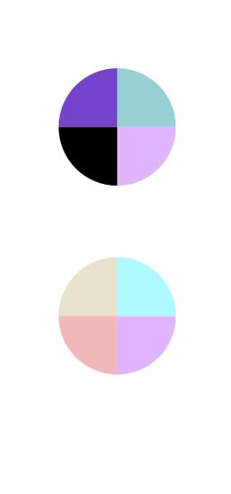

Nuestra paleta de colores esta conformada por colores que tengan contraste, y aún que no fue necesario elegir tantos colores es importante mencionarlos ya que forman parte del diseño, esta esta conformada por una paleta con tonos pastel y una con diferentes tonos. 

()